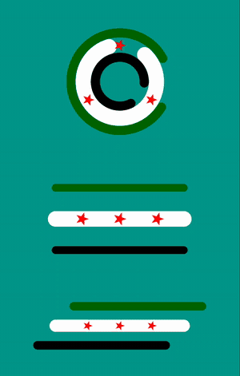
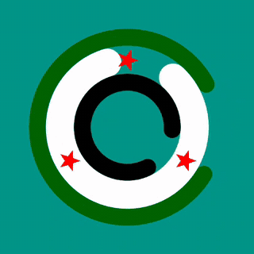
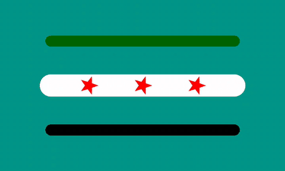
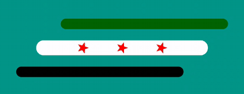

<h1 align="center">SyriaFlagProgressBar</h1>

<p align="center">
  Animated, flag-themed indeterminate progress indicators for Android — written in Kotlin, zero dependencies beyond AndroidX.
</p>

<p align="center">
  <a href="https://jitpack.io/#muhammedelsami/SyriaFlagProgressBar"></a>
  
  
  <a href="LICENSE"></a>
</p>

<p align="center">
  
</p>

## Features

- **Three ready-to-use indicators** — a rotating ring, a star line and a sliding flag line
- **Fully resolution-independent** — every stroke, star and animation distance is derived from the view's size, so the design stays intact from 16 dp up to full-screen
- **Pure `Canvas` drawing** — no images, no vector assets, no third-party libraries
- **Lifecycle-aware animation** — starts on attach, stops on detach; nothing leaks
- Works in XML layouts, programmatically and inside Jetpack Compose via `AndroidView`

## Components

| Preview | Component | Description |
|:---:|---|---|
|  | **`CircleFlagProgressBar`** | Three concentric rings (green, white, black) spinning at different speeds and directions, with three red stars on the white ring. Best in a **square** view. |
|  | **`StarLineProgressBar`** | Three horizontal bars; the outer stars glide toward the centre star and back. Best in a **wide** view (≈ 2:1). |
|  | **`FlagLineProgressBar`** | Three horizontal bars with static stars; the top and bottom bars slide in opposite directions. Best in a **wide** view (≈ 3:1). |

## Installation

**Step 1.** Add the JitPack repository to `settings.gradle.kts`:

```kotlin
dependencyResolutionManagement {
    repositories {
        google()
        mavenCentral()
        maven("https://jitpack.io")
    }
}
```

<details>
<summary>Groovy (<code>settings.gradle</code>)</summary>

```groovy
dependencyResolutionManagement {
    repositories {
        google()
        mavenCentral()
        maven { url 'https://jitpack.io' }
    }
}
```
</details>

**Step 2.** Add the dependency to your module's `build.gradle.kts`:

```kotlin
dependencies {
    implementation("com.github.muhammedelsami:SyriaFlagProgressBar:v1.0.4")
}
```

<details>
<summary>Groovy (<code>build.gradle</code>)</summary>

```groovy
dependencies {
    implementation 'com.github.muhammedelsami:SyriaFlagProgressBar:v1.0.4'
}
```
</details>

The latest version is shown on the JitPack badge above.

## Usage

### XML

```xml
<com.muhammed.syriaflagprogressbar.CircleFlagProgressBar
    android:layout_width="64dp"
    android:layout_height="64dp" />

<com.muhammed.syriaflagprogressbar.StarLineProgressBar
    android:layout_width="160dp"
    android:layout_height="80dp" />

<com.muhammed.syriaflagprogressbar.FlagLineProgressBar
    android:layout_width="180dp"
    android:layout_height="60dp" />
```

### Kotlin

```kotlin
val sizePx = (64 * resources.displayMetrics.density).toInt()
val progressBar = CircleFlagProgressBar(this).apply {
    layoutParams = ViewGroup.LayoutParams(sizePx, sizePx)
}
container.addView(progressBar)
```

Show or hide it like any other view:

```kotlin
progressBar.isVisible = isLoading
```

### Jetpack Compose

```kotlin
AndroidView(
    factory = { context -> CircleFlagProgressBar(context) },
    modifier = Modifier.size(64.dp)
)
```

## Sizing

All indicators scale with the view, so any size works. Thickness and spacing are computed from the **shorter** side of the view, while line length follows the width — keep the aspect ratios below for the intended look:

| Component | Recommended aspect ratio | Example sizes |
|---|:---:|---|
| `CircleFlagProgressBar` | 1 : 1 | `24dp`, `48dp`, `96dp` |
| `StarLineProgressBar` | ~2 : 1 | `80×40dp`, `160×80dp` |
| `FlagLineProgressBar` | ~3 : 1 | `90×30dp`, `180×60dp` |

The colours are fixed to the flag colours (green `#006400`, white, black, red).

## Sample app

The [`app`](app) module contains a small demo that shows all three indicators. Open the project in Android Studio and run the `app` configuration.

## Requirements

- Android 7.0 (API 24) or higher
- AndroidX

## Contributing

Bug reports and pull requests are welcome. For larger changes, please open an issue first to discuss what you would like to change.

## License

```
MIT License

Copyright (c) 2025 Muhammed Elşami
```

See [LICENSE](LICENSE) for the full text.
